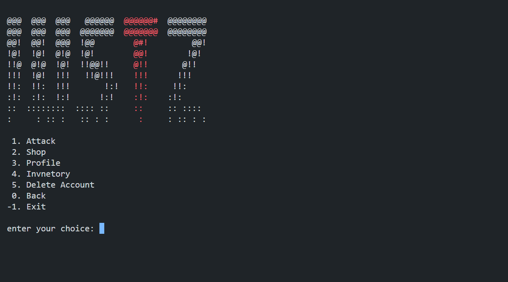
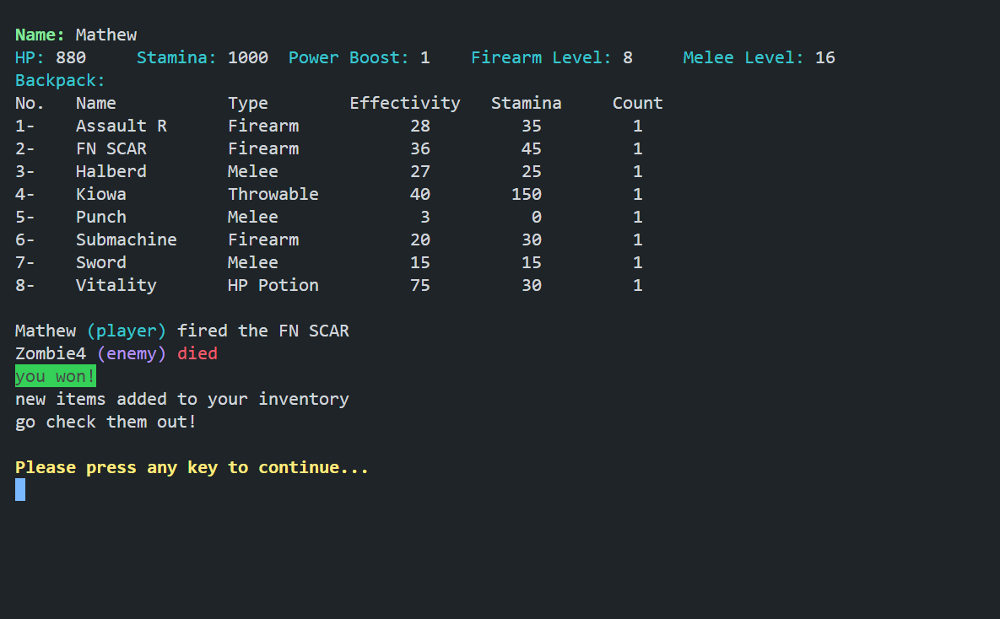
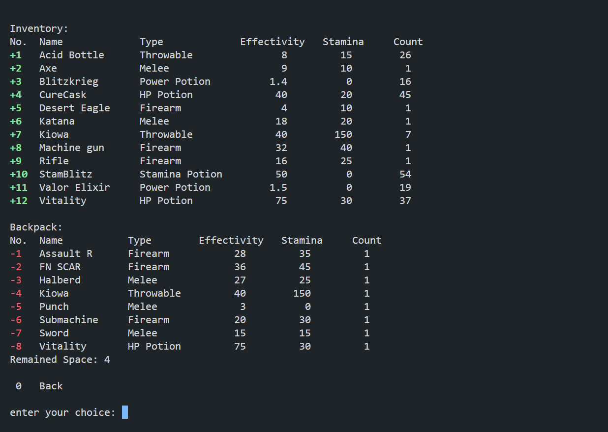

# Welcome to "IUSTZ"!

## Table of Contents
- [Welcome to "IUSTZ"!](#welcome-to-iustz)
  - [Table of Contents](#table-of-contents)
  - [Introduction ](#introduction-)
  - [Getting Started ](#getting-started-)
  - [Gameplay ](#gameplay-)
    - [Main Menu ](#main-menu-)
    - [Mission Selection ](#mission-selection-)
      - [Zombie Missions](#zombie-missions)
      - [Human Missions](#human-missions)
      - [Finale Mission](#finale-mission)
      - [Factory Functionality](#factory-functionality)
      - [Enemy Generation](#enemy-generation)
      - [Item Initialization](#item-initialization)
      - [Mission Initialization](#mission-initialization)
    - [Profile Management ](#profile-management-)
    - [Inventory ](#inventory-)
    - [Shop ](#shop-)
  - [Exiting the Game ](#exiting-the-game-)
  - [Feedback and Support ](#feedback-and-support-)

---

## Introduction 

Welcome to "IUSTZ"! This gripping text-based adventure plunges you into a harrowing post-apocalyptic world, where humanity's fight for survival rages on against the relentless tide of the undead. As a survivor, you must navigate through a landscape fraught with peril, making strategic decisions, honing your skills, and uncovering the mysteries that lie behind the zombie outbreak.

## Getting Started 

To embark on your perilous journey, simply execute the game's executable file. As the game boots up, you'll receive a welcoming message inviting you to immerse yourself fully by switching to full-screen mode. Once you've made your selection, press any key to plunge headlong into the adventure that awaits!

## Gameplay 

### Main Menu 

Upon entering the main menu, you'll be presented with a plethora of options, each crucial for your survival:

- **Attack**: Engage in missions to confront the ever-present threat of zombies and hostile humans.
- **Shop**: Traverse the shop to acquire vital items and upgrades essential for your survival.
- **Profile**: Customize and manage your character's details, including name, age, and gender, to reflect your unique survivor persona.
- **Inventory**: Access your inventory to carefully manage your arsenal of weapons, potions, and supplies.
- **Delete Account**: Should the need arise, obliterate your current game account and start anew.
- **Exit**: Bring your current session to a close and exit the game.

### Mission Selection 

Venturing into the heart of danger, you'll face the daunting task of mission selection. Each mission is meticulously crafted, offering a distinct set of challenges and objectives. From navigating through zombie-infested territories to engaging in high-stakes encounters with hostile survivors, your choices will shape your fate.

#### Zombie Missions

Explore the dark and treacherous realms infested by hordes of ravenous zombies. With escalating difficulty levels and the occasional appearance of formidable special zombie adversaries, survival becomes an ever-intensifying struggle.

#### Human Missions

Navigate through the fractured remnants of civilization, where encounters with hostile human survivors are commonplace. Adapt to diverse enemy tactics and environments as you strive to outmaneuver and outgun your adversaries.

#### Finale Mission 

In a climactic showdown, steel your resolve as you confront the sinister leader of the zombie horde. With courage as your ally, deliver the decisive blow that shatters the darkness and heralds the dawn of a new era, filled with hope and promise.

#### Factory Functionality

Fueling the dynamic nature of the game world is the factory, a sophisticated system responsible for generating enemies and orchestrating mission parameters. Through intricate algorithms, each mission unfolds as a unique and immersive experience, ensuring that no two encounters are alike.

#### Enemy Generation

Drawing upon a vast repository of enemy archetypes, the factory breathes life into the game world by spawning both common adversaries and formidable special enemies. With each encounter, players must remain vigilant and adapt their strategies to overcome evolving threats.

Employing a sophisticated Finite State Machine (FSM), the game seamlessly manages the dynamic generation of enemy encounters and factory operations. Through a network of states such as StartPoint, Attack, LowHp, LowStamina, and BoostPower, the FSM reacts to player actions and game conditions in real-time, enhancing the depth and unpredictability of the gameplay experience.

#### Item Initialization

At the outset of each mission, a diverse array of items, ranging from weapons and potions to throwable objects, are strategically placed throughout the game world. These essential resources provide players with the means to bolster their arsenal and navigate through perilous encounters.

#### Mission Initialization

From the sprawling urban landscapes to the desolate wilderness, each mission is meticulously crafted to deliver a balanced and immersive gameplay experience. Parameters such as enemy count, objectives, and rewards are carefully calibrated to ensure that players are continually challenged and rewarded for their efforts.

### Profile Management 

Your character's profile serves as a repository of vital information, tracking your progress and attributes as you traverse through the game world. From customizing your avatar to monitoring your health, stamina, and combat proficiency, profile management allows you to tailor your survivor persona to suit your playstyle.

### Inventory 

Central to your survival is the inventory system, a robust mechanism designed to help you manage your arsenal of weapons, potions, and supplies. Within this virtual storage space, you can meticulously organize your resources, ensuring that you're adequately equipped to confront the myriad challenges that lie ahead.

### Shop 

The shop beckons as a bastion of safety amidst the chaos of the post-apocalyptic world. Here, you can peruse a vast array of essential items, ranging from weapons and potions to upgrades and enhancements. Spend your hard-earned currency wisely to fortify your defenses and bolster your chances of survival.

## Exiting the Game 

When the weight of the world becomes too heavy to bear, you can gracefully exit the game from the main menu. Rest assured that your progress will be meticulously preserved, allowing you to resume your adventure at a later time.

The game's exit functionality ensures that your progress is securely saved, so you can seamlessly pick up where you left off whenever you return. Whether you're pausing for a quick break or calling it a day, the immersive world of "Invasion: Unleashed - Survivors to Zombies" will be ready and waiting for your return.

## Feedback and Support 

Your feedback is invaluable to us as we strive to improve and enhance the game experience for all players. If you encounter any issues, have suggestions for improvements, or simply want to share your thoughts and experiences, we'd love to hear from you!

Our dedicated support team is available to address any concerns and gather valuable insights to inform future updates and enhancements. Your support and feedback are deeply appreciated, and we're committed to delivering an exceptional gaming experience that exceeds your expectations.

Thank you for choosing "Invasion: Unleashed - Survivors to Zombies." Now, brace yourself for an epic adventure in a world overrun by the undead!
